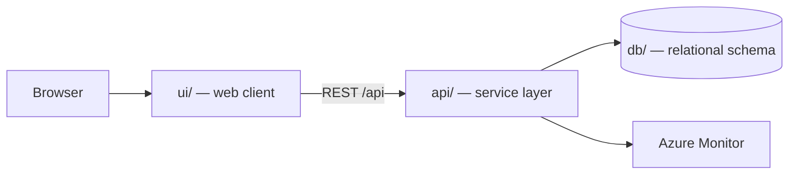

# Tutorial Interactive Chip Simulation and Education website

Students, educators, and electronics enthusiasts need an accessible way to learn digital logic and processor architecture without installing specialist desktop software or purchasing hardware. Interactive Chip Lab will let users design, simulate, debug, save, and share digital circuits and simplified microprocessors directly in a modern browser, while guided lessons connect theory to hands-on experiments.

> Generated by the **Agentic SDLC / Software Factory**. Every change reaches this
> repository through an approved human gate — no agent merges its own work.

## Table of contents

1. [Overview](#overview)
2. [Architecture](#architecture)
3. [API surface](#api-surface)
4. [Screens](#screens)
5. [Folder structure](#folder-structure)
6. [Getting started](#getting-started)
7. [Build and test](#build-and-test)
8. [Deployment](#deployment)
9. [Published links](#published-links)
10. [Requirements scope](#requirements-scope)
11. [Intake documents](#intake-documents)
12. [Licence](#licence)

## Overview

| Item | Value |
| --- | --- |
| Project | Tutorial Interactive Chip Simulation and Education website |
| Business owner | myaacoub@microsoft.com |
| IT owner | myaacoub@microsoft.com |
| Target environment | Dev |
| Work items | — |
| Source provider | GitHub |
| Repository | https://github.com/csdmichael/tutorial-interactive-chip-simulation-and-education-website |

## Architecture

Three tiers, deployed independently from this single repository:



- **ui/** renders the experience and never talks to the database directly.
- **api/** owns validation, authorization, and all data access.
- **db/** holds the schema and forward-only migrations; no ad-hoc changes.

## API surface

The service publishes an OpenAPI document, so the contract is browsable rather than
described in prose. Swagger UI is at `/docs`; the raw document is at `/openapi.json`.
The published URLs appear under [Published links](#published-links) once the pipeline runs.

| Method | Path | Purpose |
| --- | --- | --- |
| `GET` | `/health` | Liveness probe used by the deploy pipeline |
| `GET` | `/api/websites` | List websites, optionally filtered by `?status=` |
| `POST` | `/api/websites` | Create a website |
| `GET` | `/api/websites/{id}` | Fetch one website |
| `PATCH` | `/api/websites/{id}` | Update title, reference, status, priority |
| `DELETE` | `/api/websites/{id}` | Remove a website |

`db/migrations/0002_seed.sql` loads placeholder rows, and the service seeds the same rows,
so a fresh environment returns data on the first request. Replace them with real data.

## Screens

Taken from the approved UX mockups:

- **Websites**
- **Website Detail**

## Folder structure

```
.
├── ui/                  Web client
│   ├── src/             Application source
│   └── package.json     Scripts and dependencies
├── api/                 Service layer (Python (FastAPI))
│   ├── app/             Routers, models, services
│   ├── tests/           Unit and integration tests
│   └── requirements.txt Runtime dependencies
├── db/                  Database
│   ├── migrations/      Forward-only, numbered migrations
│   └── schema.sql       Current consolidated schema
├── docs/                Project documentation
│   ├── architecture.md  Tiers, data flow, decisions
│   ├── api-contracts.md Endpoint contracts
│   ├── data-model.md    Tables and relationships
│   └── delivery-plan.md Sprints and milestones
├── .github/workflows/   CI and Azure deployment pipelines
├── LICENSE              MIT
└── README.md            This file
```

## Getting started

```bash
# API
cd api && python -m venv .venv && .venv/bin/pip install -r requirements.txt
.venv/bin/uvicorn app.main:app --reload --port 8000

# UI
cd ui && npm install && npm start        # http://localhost:4200

# Database
psql "$DATABASE_URL" -f db/schema.sql
```

## Build and test

| Command | Purpose |
| --- | --- |
| `cd api && python -m pytest -q` | API unit tests |
| `cd ui && npm test` | UI unit tests |
| `.github/workflows/ci.yml and .github/workflows/deploy-azure.yml` | Runs both through GitHub Actions |

## Deployment

`.github/workflows/deploy-azure.yml` publishes the API and UI to Azure App
Service using **OIDC federated credentials** — no stored passwords. The Software
Factory configures the repository's Azure identity secrets and App Service variables
after validating the exact ID-qualified GitHub environment subject.

## Published links

<!-- agentic-sdlc:published-links:start -->
_Populated automatically once the deployment pipeline succeeds._
<!-- agentic-sdlc:published-links:end -->

## Requirements scope

- Interactive circuit design canvas (drag/drop, connect, delete, zoom/pan)
- Real-time circuit simulation with visual feedback
- Guided educational tutorials with progress tracking and theory integration
- Responsive UI for desktop and mobile
- Input validation and clear user feedback
- Sample data and automated tests for main workflow
- **CircuitCanvas.jsx**: Interactive canvas for circuit design (drag/drop, connect, delete, zoom/pan).
- **LogicGatePalette.jsx**: Palette of logic gates/components for drag-and-drop.
- **SimulationPanel.jsx**: Real-time simulation display, signal visualization, error feedback.
- **TutorialPanel.jsx**: Guided lessons, theory explanations, progress tracking.
- **FeedbackSnackbar.jsx**: Success/error messages for user actions.
- **Hooks**: Custom hooks for simulation logic and tutorial progress.

## Intake documents

- `requirements` — [tutorial-interactive-chip-simulation-and-education-website-requirements.md](https://github.com/csdmichael/tutorial-interactive-chip-simulation-and-education-website/blob/main/docs/intake/requirements/tutorial-interactive-chip-simulation-and-education-website-requirements.md)

## Licence

MIT — see [LICENSE](LICENSE).
